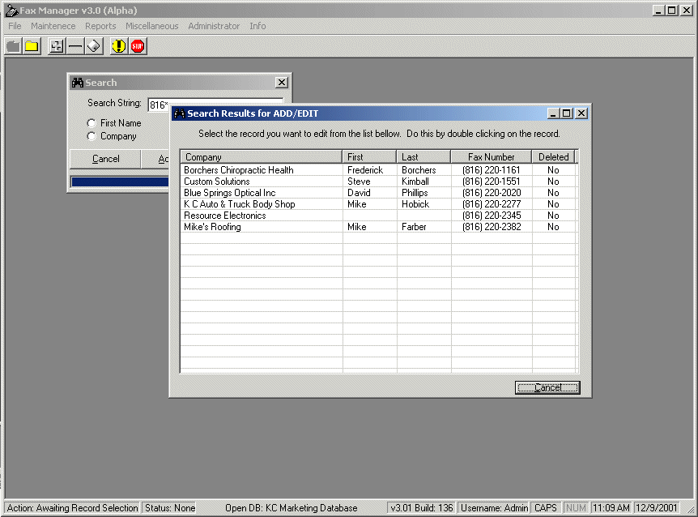



## Fax Manager

### Description

To quickly add, edit, remove and export records in a database for a fax blaster. This program illustrates 46-bit encryption, adodb database interactivity, wild card searches, grids, basic registry, user security, deleting records, multiple styles of finds, plus much more...

I know that there are some bugs, but we use this internally, and do not have to trap everything.

NOTE: USERNAME: Admin PASSWORD: Admin
 
### More Info
 
This program uses three different Access 2000 databases. One database is for user and configuration management, while another is the fax list itself, and finally there is a database for the export routine.

It is best to keep all of the databases within the directory of the software source code. The program automatically looks for its system databases with in the application directory (where the program is run from).

This program returns all the data in a format that uses MS Access to become a phonebook for a fax blasting program.

This program will create multiple system keys in the ODBC upon running. It will not cause any damage to your system. The login username and password is Admin (not case sensitive).

             |
---                |---
**Submitted On**   |2001-12-18 18:09:40
**By**             |[Joel Hartenbower](https://github.com/Planet-Source-Code/PSCIndex/blob/master/ByAuthor/joel-hartenbower.md)
**Level**          |Intermediate
**User Rating**    |4.3 (13 globes from 3 users)
**Compatibility**  |VB 6\.0
**Category**       |[Complete Applications](https://github.com/Planet-Source-Code/PSCIndex/blob/master/ByCategory/complete-applications__1-27.md)
**World**          |[Visual Basic](https://github.com/Planet-Source-Code/PSCIndex/blob/master/ByWorld/visual-basic.md)
**Archive File**   |[Fax\_Manage4291512182001\.zip](https://github.com/Planet-Source-Code/joel-hartenbower-fax-manager__1-29615/archive/master.zip)

